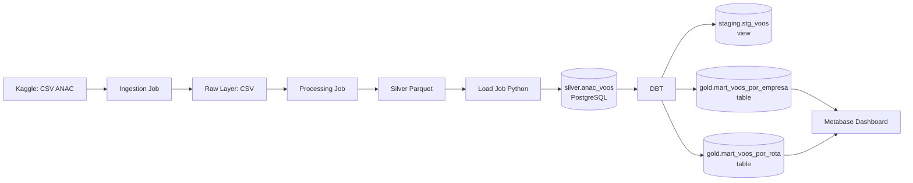

# Lab02_18106196 — Transformação de Dados com DBT

Pipeline de dados ANAC com transformação Silver → Gold usando **dbt-postgres** e visualização via **Metabase**.

## 0. Configuração de variáveis de ambiente

Crie um arquivo `.env` na raiz do projeto:
```.env
KAGGLE_API_TOKEN=
```
Preencha com o seu token da API do Kaggle.

## 1. Arquitetura



## 2. Como executar

### 2.1 Subir o banco

```bash
docker compose up postgres -d
```

O `sql/ddl.sql` cria automaticamente o schema `silver` e a tabela `silver.anac_voos`.

### 2.2 Pipeline de ingestão (Raw → Silver → Postgres)

```bash
docker compose up ingestao
```

Executa: download Kaggle → processamento Polars → carga em `silver.anac_voos`.

### 2.3 Transformações DBT (Silver → Gold)

```bash
docker compose up dbt
```

O container executa em sequência:
```
dbt debug            # valida conexão
dbt run              # cria views staging e tabelas gold
dbt test             # roda todos os testes
dbt docs generate    # gera documentação HTML
```

### 2.4 Metabase (BI)

```bash
docker compose up metabase -d
```

Acesse [http://localhost:3000](http://localhost:3000) e configure a conexão:
- Host: `postgres` | Porta: `5432` | DB: `lab_02_db` | User: `user` | Password: `123`

---

## 3. Estrutura DBT

```
dbt_project/
├── dbt_project.yml
├── profiles.yml
├── models/
│   ├── staging/
│   │   ├── sources.yml          # source: silver.anac_voos
│   │   ├── stg_voos.sql         # view com limpeza + macro sazonal
│   │   └── schema.yml           # testes genéricos
│   └── marts/
│       ├── mart_voos_por_empresa.sql
│       ├── mart_voos_por_rota.sql
│       └── schema.yml           # testes genéricos + FK
├── macros/
│   ├── classify_period.sql      # classifica trimestre em período sazonal
│   └── generate_schema_name.sql # usa nomes exatos de schema
└── tests/
    ├── assert_passageiros_positivos.sql
    └── assert_voos_validos.sql
```

### Models

| Model | Schema | Tipo | Descrição |
|---|---|---|---|
| `stg_voos` | `staging` | view | Staging com tipagem, filtros e macro sazonal |
| `mart_voos_por_empresa` | `gold` | table | Métricas por empresa, ano e trimestre |
| `mart_voos_por_rota` | `gold` | table | Métricas por rota (origem/destino) e ano |

### Macro `classify_period`

```sql
{{ classify_period('nr_trimestre_referencia') }}
-- Retorna: 'Q1 - Verão/Carnaval' | 'Q2 - Outono' | 'Q3 - Inverno/Férias' | 'Q4 - Primavera/Natal'
```

### Testes

| Tipo | Teste | Regra |
|---|---|---|
| Genérico | `not_null` | Colunas-chave de todos os models |
| Genérico | `accepted_values` | `trimestre` ∈ {1,2,3,4} ; `mes` ∈ {1..12} |
| Genérico | `relationships` | IDs de aeroporto em `mart_voos_por_rota` → `stg_voos` |
| Singular | `assert_passageiros_positivos` | `passageiros >= 0` |
| Singular | `assert_voos_validos` | `total_voos > 0` e `distancia_media_km > 0` |

---

## 4. Executar DBT localmente (sem Docker)

```bash
pip install dbt-postgres==1.8.2
cd dbt_project

export DBT_HOST=localhost
export DBT_USER=user
export DBT_PASSWORD=123
export DBT_DBNAME=lab_02_db

dbt run   --profiles-dir .
dbt test  --profiles-dir .
dbt docs generate --profiles-dir .
dbt docs serve    --profiles-dir .   # http://localhost:8080
```

---

## 5. Dashboard Metabase

Visualizações recomendadas na camada Gold:

1. **Barras** — Total de voos por empresa (filtro por ano) → `gold.mart_voos_por_empresa`
2. **Linha** — Evolução de passageiros por trimestre/ano → `gold.mart_voos_por_empresa`
3. **Tabela** — Top 20 rotas por volume de passageiros → `gold.mart_voos_por_rota`

---

## 6. Prints do projeto

> Após executar, adicione os prints em `docs/prints/`:
> - `dbt_docs_overview.png` — tela de documentação gerada pelo DBT
> - `dbt_lineage.png` — grafo de lineage do DBT
> - `metabase_dashboard.png` — dashboard no Metabase

---

## 7. Documentação das etapas do pipeline

### 7.1 Ingestion Job (`src/ingestion/job.py`)
- Download do dataset ANAC via Kaggle API.
- Salva os arquivos CSV na camada Raw (`data/raw/`).

### 7.2 Processing Job (`src/processing/job.py`)
- Limpeza com Polars: separadores decimais, cast de tipos, conversão de datas.
- Exporta Parquet particionado por `dt_referencia` em `data/silver/data/`.

### 7.3 Load Job (`src/load/job.py`) — **modificado para Lab02**
- Lê o Parquet da camada Silver.
- Carrega via `COPY` (bulk insert) na tabela flat `silver.anac_voos` no PostgreSQL.
- **Diferença do Lab01:** não cria mais o star schema diretamente — isso é responsabilidade do DBT.

### 7.4 DBT (Silver → Gold)
- `stg_voos` (view): tipagem, filtros, macro `classify_period`.
- `mart_voos_por_empresa` (table): agrega por empresa, ano, trimestre, taxa de ocupação.
- `mart_voos_por_rota` (table): agrega por par origem/destino e ano.

## 8. Dicionário de Dados — `silver.anac_voos`

| Coluna | Tipo | Descrição |
|---|---|---|
| id_basica | TEXT | Identificador único do voo |
| id_empresa | INTEGER | ID da companhia aérea |
| nm_empresa | TEXT | Nome da empresa aérea |
| sg_empresa_iata | TEXT | Código IATA da empresa |
| nm_pais | TEXT | País da empresa |
| id_aerodromo_origem | INTEGER | ID do aeroporto de origem |
| nm_municipio_origem | TEXT | Cidade de origem |
| sg_uf_origem | TEXT | UF de origem |
| nm_regiao_origem | TEXT | Região de origem |
| id_aerodromo_destino | INTEGER | ID do aeroporto de destino |
| nm_municipio_destino | TEXT | Cidade de destino |
| sg_uf_destino | TEXT | UF de destino |
| dt_referencia | DATE | Data de referência |
| nr_ano_referencia | INTEGER | Ano |
| nr_trimestre_referencia | INTEGER | Trimestre (1–4) |
| nr_mes_referencia | INTEGER | Mês (1–12) |
| nr_decolagem | INTEGER | Número de decolagens |
| nr_passag_pagos | FLOAT | Passageiros pagos |
| kg_carga_paga | FLOAT | Carga paga (kg) |
| nr_horas_voadas | FLOAT | Horas voadas |
| km_distancia | FLOAT | Distância (km) |
| nr_assentos_ofertados | FLOAT | Assentos ofertados |
