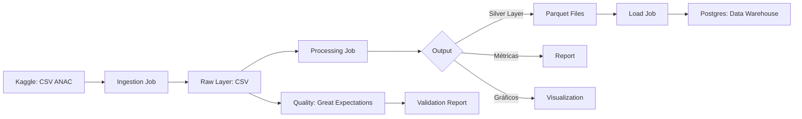

# Lab01_PART2_NUSP
Repo público no github: [link](https://github.com/gustavocn121/Lab01_PART1_NUSP)

## 0. Configuração de variáveis de ambiente

Crie um arquivo .env na raiz do projeto com o seguinte conteúdo:
```.env
KAGGLE_API_TOKEN=
```
Preencha o valor com o seu token da API do Kaggle.

## 1. Arquitetura



## 2. Documentação da Tarefa

### 2.1 Ingestion Job (`src/ingestion/job.py`)
- Conexão com Kaggle via `kaggle_client.py`.
- Download dos dados brutos da ANAC.
- Salva os arquivos CSV na camada Raw.

### 2.2 Processing Job (`src/processing/job.py`)
- **Limpeza de dados:**
  - Padronização de tipos usando `schema.py`
  - Tratamento de separadores decimais (`,` → `.`)
  - Conversão de datas para formato `YYYY-MM-DD`
  - Castings de tipos (Int32, Int16, Float16, etc.)
  - Transformação de colunas `nr_*` para `nm_*` (semântica)
- **Execução de subprocessos:**
  - Chama `report.py` para geração de métricas
  - Chama `visualization.py` para criação de gráficos
- **Exportação:**
  - Salva dados processados em formato Parquet na camada Silver

### 2.3 Report (`src/processing/report.py`)
- Geração de relatório de caracterização dos dados
- Análise de qualidade de dados (nulos, duplicados)
- Cálculo de métricas por coluna
- Criação de relatórios tabulares em Markdown

### 2.4 Visualization (`src/processing/visualization.py`)
- Criação de gráficos exploratórios
- Visualizações salvas em `docs/plots/`

### 2.5 Load Job (`src/load/job.py`)
- Leitura dos arquivos Parquet da camada Silver
- **Uso de COPY para bulk insert:** Streaming com buffer de CSV para maior performance
- **Inserção em tabelas Postgres:**
  - `dim_data` - Datas (data, ano, trimestre, mês)
  - `dim_empresa` - Companhias aéreas (ID, nome, IATA, ICAO, país)
  - `dim_aeroporto` - Aeroportos (ID, código, nome, país)
  - `fato_voos` - Transações de voos com medidas de quantidade e peso

### 2.6 Quality (`src/quality/validate_raw.py`)
- Validação dos dados brutos com **Great Expectations**
- Expectations configuradas:
  - Verificação de nulos em colunas críticas
  - Validação de ranges numéricos
  - Validação de formatos de data
- Geração automática de relatório HTML em `gx/uncommitted/data_docs/`

## 3. Dicionário de Dados

Coluna                     | Tipo       | Descrição
----------------------------|------------|-----------
id_basica                   | Int32      | Identificador único do voo
id_empresa                  | Int32      | ID da companhia aérea
sg_empresa_icao             | String     | Código ICAO da empresa
sg_empresa_iata             | String     | Código IATA da empresa
nm_empresa                  | String     | Nome da empresa aérea
nm_pais                     | String     | País da empresa
dt_referencia               | Date       | Data de referência do voo
nr_decolagem                | Int32      | Número de decolagens
nr_passag_pagos             | Int32      | Passageiros pagos
nr_passag_gratis            | Int32      | Passageiros gratuitos
kg_carga_paga               | Float32    | Carga paga em kg
km_distancia                | Float32    | Distância percorrida em km
id_aerodromo_origem         | Int16      | ID do aeroporto de origem
id_aerodromo_destino        | Int16      | ID do aeroporto de destino
nr_horas_voadas             | Float16    | Horas voadas
nr_velocidade_media         | Float16    | Velocidade média do voo

## 4. Qualidade de Dados

- **sg_empresa_iata**: 559.947 nulos -> ~2,5% das linhas.
- **nm_pais**: 184 nulos -> % muito pequeno.
- **nr_singular**: 224.985 nulos -> ~1% das linhas não possuem número singular do voo.
- **id_arquivo** e **nm_arquivo**: 1.420.081 nulos
- **id_aerodromo_origem** / **id_aerodromo_destino**: 21.473 nulos -> aproximadamente 0,1% dos voos não têm aeroporto associado.
- **nr_decolagem**: 1.780.441 nulos -> ~8% dos voos não têm registro de decolagem, impactando métricas de quantidade de voos.
- **kg_payload** e **kg_carga_paga**: mais de 356.383 nulos -> ~1,6% dos registros sem peso de carga.
- **nr_passag_pagos**: 214.985 nulos -> ~1% dos registros sem passageiros pagantes.
- **nr_passag_gratis**: 100.1252 nulos -> registros sem passageiros gratuitos.
- **nr_horas_voadas** e **nr_velocidade_media**: 417.106 e 356.383 nulos -> cerca de 1,6% dos registros sem dados de voo ou velocidade média.

## 5. Instruções de Execução

### Pré-requisitos

- [Docker](https://docs.docker.com/get-docker/) instalado e em execução
- Arquivo `.env` configurado na raiz do projeto (ver seção 0)

### 5.1 Construir a imagem Docker

Na raiz do projeto, execute:

```bash
docker-compose build
```

### 5.2 Subir os containers

O projeto possui três serviços definidos no `docker-compose.yml`:

| Serviço    | Descrição                          | Porta |
|------------|------------------------------------|-------|
| `postgres`  | Banco de dados PostgreSQL          | 5432  |
| `ingestao`  | Pipeline de ingestão e validação   | —     |
| `metabase`  | Dashboard de visualização          | 3000  |

Para subir todos os containers:

```bash
docker-compose up
```

Para encerrar os containers:

```bash
docker-compose down
```

### 5.3 Executar as validações do Great Expectations

As validações são executadas automaticamente ao subir o container `ingestao` (via `docker-compose up`), pois fazem parte do pipeline principal em `src/main.py`.

Para executar **somente** as validações do Great Expectations localmente (sem Docker):

```bash
python -m venv .venv
# source .venv/bin/activate   # Linux/macOS
.venv\Scripts\activate    # Windows

pip install uv
uv sync

python -m src.quality.validate_raw
```

As expectations configuradas validam os dados brutos da ANAC verificando:

| Expectation | Coluna | Regra |
|---|---|---|
| `expect_column_values_to_not_be_null` | `id_basica` | Sem nulos |
| `expect_column_values_to_not_be_null` | `nm_empresa` | Sem nulos |
| `expect_column_values_to_be_between` | `nr_voo` | Entre 1 e 9999 |
| `expect_column_values_to_be_between` | `nr_assentos_ofertados` | Entre 10 e 800 |
| `expect_column_values_to_match_strftime_format` | `dt_referencia` | Formato `%Y-%m-%d` |
| `expect_column_values_to_match_strftime_format` | `dt_partida_real` | Formato `%Y-%m-%d` |
| `expect_column_values_to_match_strftime_format` | `dt_chegada_real` | Formato `%Y-%m-%d` |
| `expect_column_values_to_be_between` | `kg_payload` | Entre 0 e 50000 |
| `expect_column_values_to_be_between` | `km_distancia` | Entre 0 e 10000 |

Após a execução, o relatório HTML do Great Expectations é gerado automaticamente em `gx/uncommitted/data_docs/`. Para visualizá-lo, abra o arquivo `index.html` no navegador.

### 5.4 Métricas de negócio e gráficos

- Os gráficos gerados estão disponíveis em [`docs/plots`](docs/plots)
- O arquivo markdown contendo elas está em [`docs/graficos.md`](docs/graficos.md)
- A query com as métricas de negócio e suas respectivas queries estão disponíveis em [`docs/metricas.md`](docs/metricas.md)
