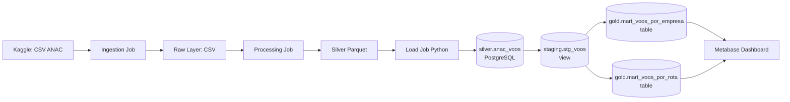
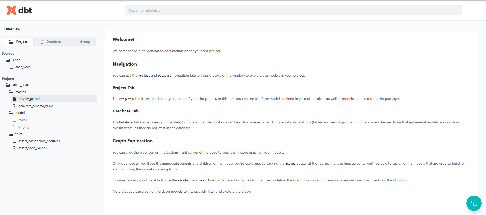
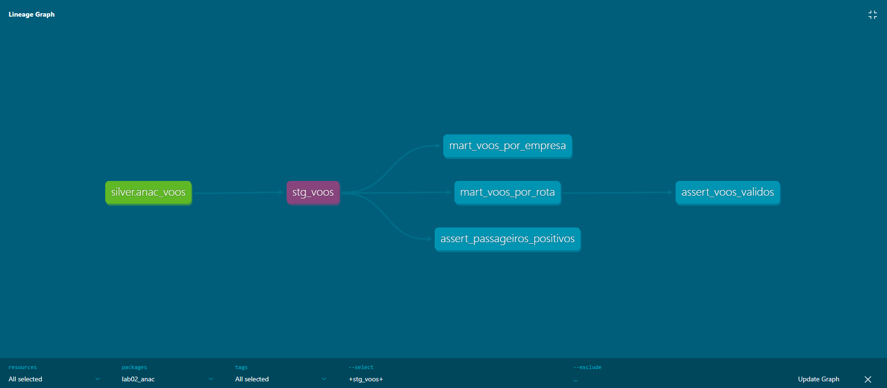
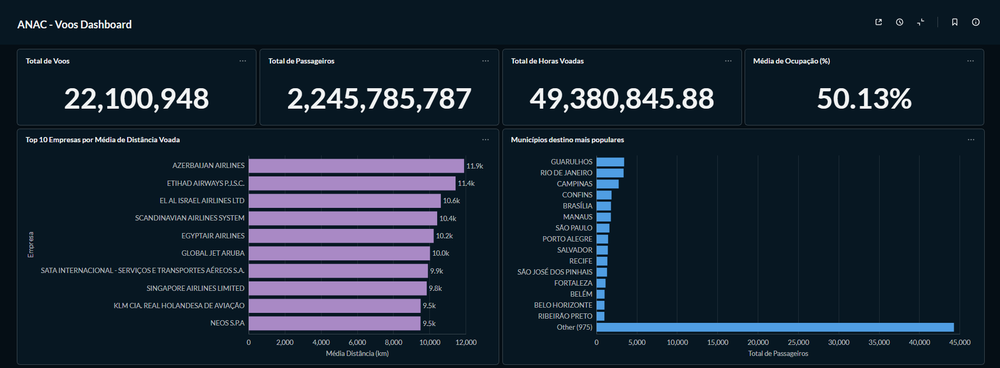
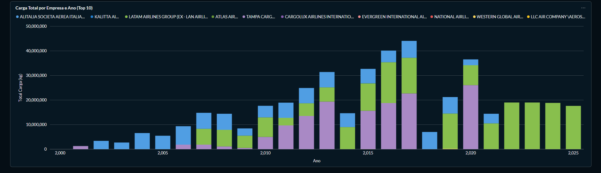

# Lab02_18106196 — Transformação de Dados com DBT

Pipeline de dados ANAC com transformação Silver → Gold usando **dbt** e visualização via **Metabase**.

---

## 0. Pré-requisitos

- [Docker](https://www.docker.com/) instalado e em execução
- Python 3.10+ (para desenvolvimento local, opcional)
- Token da API do Kaggle

**Configuração de Kaggle API:** Crie um arquivo `.env` na raiz do projeto:

```.env
KAGGLE_API_TOKEN=seu_token_aqui
```

**Dependências Python:** O projeto usa as seguintes versões principais:
- `polars==1.39.2` — Processamento de dataframes
- `dbt-postgres==1.8.x` — dbt para PostgreSQL
- `psycopg2==2.9.11` — Adaptador PostgreSQL
- `kagglehub==1.0.0` — Download de datasets do Kaggle
---

## 1. Arquitetura



---

## 2. Como executar

### 2.1 Executar o pipeline completo

```bash
docker compose up
```

Os serviços sobem em ordem automática com dependências encadeadas:

```
postgres (healthy) → ingestao → dbt (encerra)  -→ metabase  :3000
                                               |→ dbt-docs  :8001
```

| Etapa | Serviço | O que faz |
|---|---|---|
| 1 | `postgres` | Sobe o banco e executa `sql/ddl.sql` (schema `silver` + tabela `anac_voos`) |
| 2 | `ingestao` | Download Kaggle → processamento Polars → carga em `silver.anac_voos` |
| 3 | `dbt` | `dbt debug` → `dbt run` → `dbt test` — encerra |
| 4 | `dbt-docs` | `dbt docs generate` → `dbt docs serve --profiles-dir /dbt --host 0.0.0.0 --port 8001`<br> a documentação gerada em [http://localhost:8001](http://localhost:8001) |
| 5 | `metabase` | Sobe o BI em [http://localhost:3000](http://localhost:3000) |

> `dbt-docs` e `metabase` só sobem após o `dbt` encerrar com sucesso.

### 2.2 Configurar conexão no Metabase

Ao acessar [http://localhost:3000](http://localhost:3000) pela primeira vez, configure a conexão ao banco:

| Parâmetro | Valor |
|---|---|
| Host | `postgres` |
| Porta | `5432` |
| Database | `lab_02_db` |
| Usuário | `user` |
| Senha | `123` |

---

## 3. Estrutura DBT

```
dbt_project/
├── dbt_project.yml
├── profiles.yml
├── models/
│   ├── staging/
│   │   ├── sources.yml          # source: silver.anac_voos
│   │   ├── stg_voos.sql         # view com limpeza + macro de período
│   │   └── schema.yml           # testes genéricos
│   └── marts/
│       ├── mart_voos_por_empresa.sql
│       ├── mart_voos_por_rota.sql
│       └── schema.yml           # testes genéricos + FK
├── macros/
│   ├── classify_period.sql      # classifica trimestre
│   └── generate_schema_name.sql # atualiza nome do schema
└── tests/
    ├── assert_passageiros_positivos.sql # passageiros < 0
    └── assert_voos_validos.sql # total_voos <= 0 OR distancia_media_km <= 0
```

### Models

| Model | Schema | Tipo | Descrição |
|---|---|---|---|
| `stg_voos` | `staging` | view | Staging com tipagem, filtros e macro sazonal |
| `mart_voos_por_empresa` | `gold` | table | Métricas por empresa, ano e trimestre |
| `mart_voos_por_rota` | `gold` | table | Métricas por rota (origem/destino) e ano |

### Macro `classify_period`

Classifica o trimestre de referência em um período sazonal brasileiro. Chamada dentro de `stg_voos.sql`:

```sql
{{ classify_period('nr_trimestre_referencia') }}
-- Retorna: 'Q1 - Verão/Carnaval' | 'Q2 - Outono' | 'Q3 - Inverno/Férias' | 'Q4 - Primavera/Natal'
```

### Macro `generate_schema_name`

Garante que os models sejam criados nos schemas exatos definidos no `dbt_project.yml` (`staging`, `gold`), sem o prefixo padrão do dbt (ex: `public_staging`).

### Testes

| Tipo | Teste | Regra |
|---|---|---|
| Genérico | `not_null` | Colunas-chave de todos os models |
| Genérico | `accepted_values` | `trimestre` ∈ {1,2,3,4} ; `mes` ∈ {1..12} |
| Genérico | `relationships` | IDs de aeroporto em `mart_voos_por_rota` → `stg_voos` |
| Singular | `assert_passageiros_positivos` | `passageiros >= 0` |
| Singular | `assert_voos_validos` | `total_voos > 0` e `distancia_media_km > 0` |

---

## 4. Documentação DBT

Após executar o pipeline, a documentação é gerada automaticamente e servida em [http://localhost:8001](http://localhost:8001).

### 4.1 Visão geral da documentação



### 4.2 Lineage Graph



---

## 5. Dashboard Metabase

Visualizações disponíveis na camada Gold:

1. **Barras** — Top 10 Empresas por Média de Distância Voada → `gold.mart_voos_por_empresa`
2. **Barras** — Municípios destino mais populares → `gold.mart_voos_por_empresa`
3. **Barras empilhadas** — Carga Total por Empresa e Ano (Top 10) → `gold.mart_voos_por_rota`





---

## 6. Documentação das etapas do pipeline

### 6.1 Ingestion Job (`src/ingestion/job.py`)
- Download do dataset ANAC via Kaggle API.
- Salva os arquivos CSV na camada Raw (`data/raw/`).

### 6.2 Processing Job (`src/processing/job.py`)
- Limpeza com Polars: separadores decimais, cast de tipos, conversão de datas.
- Exporta Parquet particionado por `dt_referencia` em `data/silver/data/`.

### 6.3 Load Job (`src/load/job.py`)
- Lê o Parquet da camada Silver
- Transforma e valida 26 colunas com casting de tipos específicos.
- Carrega via `COPY` (bulk insert) na tabela flat `silver.anac_voos` no PostgreSQL.
- **Diferença do Lab01:** não cria o star schema diretamente — isso é responsabilidade do DBT.

### 6.4 DBT (Silver → Gold)
- `stg_voos` (view): tipagem, filtros, macro `classify_period`.
- `mart_voos_por_empresa` (table): agrega por empresa, ano, trimestre, taxa de ocupação.
- `mart_voos_por_rota` (table): agrega por par origem/destino e ano.

---

## 7. Dicionário de Dados

### 7.1 Silver Layer — `silver.anac_voos`

Tabela raw carregada diretamente do dataset ANAC. Contém os dados originais com mínima transformação.

| Coluna | Tipo | Descrição |
|---|---|---|
| id_basica | TEXT | Identificador único do voo |
| id_empresa | INTEGER | ID da companhia aérea |
| nm_empresa | TEXT | Nome da empresa aérea |
| sg_empresa_iata | TEXT | Código IATA da empresa |
| nm_pais | TEXT | País da empresa |
| id_aerodromo_origem | INTEGER | ID do aeroporto de origem |
| nm_municipio_origem | TEXT | Cidade de origem |
| sg_uf_origem | TEXT | UF de origem |
| nm_regiao_origem | TEXT | Região de origem |
| id_aerodromo_destino | INTEGER | ID do aeroporto de destino |
| nm_municipio_destino | TEXT | Cidade de destino |
| sg_uf_destino | TEXT | UF de destino |
| dt_referencia | DATE | Data de referência |
| nr_ano_referencia | INTEGER | Ano |
| nr_trimestre_referencia | INTEGER | Trimestre (1–4) |
| nr_mes_referencia | INTEGER | Mês (1–12) |
| nr_decolagem | INTEGER | Número de decolagens |
| nr_passag_pagos | FLOAT | Passageiros pagos |
| kg_carga_paga | FLOAT | Carga paga (kg) |
| nr_horas_voadas | FLOAT | Horas voadas |
| km_distancia | FLOAT | Distância (km) |
| nr_assentos_ofertados | FLOAT | Assentos ofertados |

### 7.2 Staging Layer — `staging.stg_voos`

View que realiza transformações e limpeza de dados: tipagem, filtros, normalização de colunas e enriquecimento com período sazonal.

| Coluna | Tipo | Descrição |
|---|---|---|
| id_basica | TEXT | Identificador único do voo |
| id_empresa | INTEGER | ID da companhia aérea |
| nm_empresa | TEXT | Nome da empresa aérea |
| sg_empresa_iata | TEXT | Código IATA da empresa |
| nm_pais | TEXT | País da empresa |
| id_aerodromo_origem | INTEGER | ID do aeroporto de origem |
| nm_aerodromo_origem | TEXT | Nome do aeroporto de origem |
| nm_municipio_origem | TEXT | Cidade de origem |
| sg_uf_origem | TEXT | UF de origem |
| nm_regiao_origem | TEXT | Região de origem |
| id_aerodromo_destino | INTEGER | ID do aeroporto de destino |
| nm_aerodromo_destino | TEXT | Nome do aeroporto de destino |
| nm_municipio_destino | TEXT | Cidade de destino |
| sg_uf_destino | TEXT | UF de destino |
| nm_regiao_destino | TEXT | Região de destino |
| dt_referencia | DATE | Data de referência |
| ano | INTEGER | Ano (extraído de dt_referencia) |
| trimestre | INTEGER | Trimestre (1–4) |
| mes | INTEGER | Mês (1–12) |
| periodo_sazonal | TEXT | Classificação sazonal brasileira (Q1–Q4) — gerada pela macro `classify_period` |
| quantidade_voos | INTEGER | Número de decolagens (de nr_decolagem; padrão 0 se nulo) |
| passageiros | INTEGER | Passageiros pagos (de nr_passag_pagos; padrão 0 se nulo) |
| carga_kg | FLOAT | Carga paga em kg (de kg_carga_paga; padrão 0 se nulo) |
| horas_voadas | FLOAT | Total de horas voadas (de nr_horas_voadas; padrão 0 se nulo) |
| distancia_km | FLOAT | Distância em km (de km_distancia; padrão 0 se nulo) |
| assentos_ofertados | FLOAT | Assentos ofertados (de nr_assentos_ofertados; padrão 0 se nulo) |

### 7.3 Gold Layer — Marts (Tabelas de Análise)

#### `gold.mart_voos_por_empresa`

Agrega métricas por companhia aérea, ano e trimestre sazonal.

| Coluna | Tipo | Descrição |
|---|---|---|
| id_empresa | INTEGER | ID da companhia aérea |
| nm_empresa | TEXT | Nome da empresa |
| sg_empresa_iata | TEXT | Código IATA |
| nm_pais | TEXT | País da empresa |
| ano | INTEGER | Ano |
| trimestre | INTEGER | Trimestre |
| periodo_sazonal | TEXT | Período sazonal |
| registros | INTEGER | Contagem de registros |
| total_voos | INTEGER | Soma de quantidade_voos |
| total_passageiros | INTEGER | Soma de passageiros |
| total_carga_kg | FLOAT | Soma de carga_kg |
| total_horas_voadas | FLOAT | Soma de horas_voadas |
| media_distancia_km | NUMERIC(10,2) | Média de distancia_km (2 casas decimais) |
| total_assentos_ofertados | FLOAT | Soma de assentos_ofertados |
| taxa_ocupacao_pct | NUMERIC(5,2) | Taxa de ocupação = (total_passageiros / total_assentos_ofertados) × 100 |

#### `gold.mart_voos_por_rota`

Agrega métricas por rota (par origem/destino) e ano.

| Coluna | Tipo | Descrição |
|---|---|---|
| id_aerodromo_origem | INTEGER | ID aeroporto origem |
| nm_aerodromo_origem | TEXT | Nome aeroporto origem |
| nm_municipio_origem | TEXT | Município origem |
| sg_uf_origem | TEXT | UF origem |
| nm_regiao_origem | TEXT | Região origem |
| id_aerodromo_destino | INTEGER | ID aeroporto destino |
| nm_aerodromo_destino | TEXT | Nome aeroporto destino |
| nm_municipio_destino | TEXT | Município destino |
| sg_uf_destino | TEXT | UF destino |
| nm_regiao_destino | TEXT | Região destino |
| ano | INTEGER | Ano |
| registros | INTEGER | Contagem de registros |
| total_voos | INTEGER | Soma de quantidade_voos |
| total_passageiros | INTEGER | Soma de passageiros |
| distancia_media_km | NUMERIC(10,2) | Média de distancia_km (2 casas decimais) |
| total_carga_kg | FLOAT | Soma de carga_kg |
